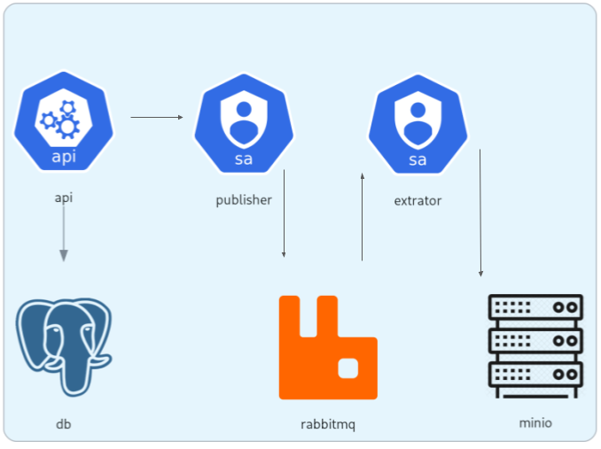

# SAPJu

SAPJu defini com as iniciais de *`Sistema de Análise de Processos Jurídicos`* + `u` minusculo. 

Melhor [referência](desafio-python-developer.md) do Sistema. O Sistema distribuído foi desenvolvido com o frame do Python FastAPI, com Docker, Banco de Dados Postgres, eventos com RabbitMQ (*broker* de eventos) e MinIO como storage das extrações. São três microsserviços FastAPI:
- API: App Backend de Processo e Documentos
- Publisher: Responsável inserir na fila de eventos do RabbitMQ
- Extrator: Responsável por consumir a fila de eventos do RabbitMQ e Realizar a Extração dos Textos dos Documentos (cadastrados na API).
Porquê FastAPI?: Python, Assincrono nativo, alto desempeho, alta performance, leve, moderno, totalmente integrável e muito mais.

## Diretórios do Projeto
- `sapju`: A API (FastAPI), backend de cadastro de Processo e Documentos (PDFs)
- `Publisher`: Microsserviço (FastAPI) que lança eventos na fila do RabbitMQ.
- `Extrator`: Microsserviço (FastAPI) Consumidor do RabbitMQ e Extrator de Texto dos PDFs
- `documentos`: Documentos exemplos utilizados na App.

## Subindo o Sistema

```bash
docker compose up -d
```
⚠️ Devido às dependencias entre os serviços, é normal aparecer "Error" no inicio do proceso. Ao concluir, todos os containers estarão prontos.
Sugiro em seguida:
```bash
# .. Devido ao RabbitMQ demorar um pouco a subir
docker restart sapju_publisher sapju_extrator
```

Swagger da API: [http://127.0.0.1:5000/docs](http://127.0.0.1:5000/docs)

Swagger do Publisher de Documentos: [http://127.0.0.1:5673/docs](http://127.0.0.1:5673/docs)

Swagger do Extrator de Documentos: [http://127.0.0.1:5674/docs](http://127.0.0.1:5674/docs)

Admin Web do MinIO (S3/armazenamento da Extração dos documentos): [http://localhost:9001](http://localhost:9001)

E, as configurações e credenciais do sistema estão em `/sapju/app/.env` e em `compose.yml`.

## Troubleshooting

Listando serviços `docker ps`.
Sempre bom verificar de algum dos serviços não subiram ou cairam `docker logs -f sapju_publisher`. Sendo assim, `docker restart sapju_publisher`, por exemplo. 


## Utilizando a API

### Cadastrando o Processo
Endpoint: 
~~~bash
http://localhost:5000/api/processo
~~~
Body:
``` json
{
  "classe": "ARE",
  "numero": 123456,
  "orgao_origem": "STF"
}
```

### Upload de Documento(s)
Enpoint:
~~~bash
http://localhost:5000/api/processos/{processo_id}/documentos
~~~
Em Body, escolher `form-data`, criar a `Key` *`arquivos`* e o tipo dessa `Key` é *`File`*. Em `Value`, selecione o Documento para upload.

### Consultando o Processo
Endpoint: 
~~~bash
http://localhost:5000/api/processos/{processo_id}
~~~

### Consultando um Documento
Endpoint:
~~~bash
http://localhost:5000/api/processos/{processo_id}/documentos/{documento_id}
~~~

### Status da Extração do Texto
Endpoint: 
~~~bash
http://localhost:5000/api/processos/{processo_id}/documentos/{documento_id}/status
~~~


## Arquitetura da Aplicação

Os Processos Judiciais e Documentos são cadastrados via Api. Assim que os documento são inseridos, são lançados (*publisher*) na esteira de eventos do Rabbit.
O extrator consome os arquivos disponíveis na fila, realiza a extração de texto e persiste em outro serviço de *storage* MinIO.




## Melhorias e Futuras Features

Concluir a ETL (Extrair, Transformar e Carregar). Pois ainda faltaria Transformar e Carregar.

Uma camada posterior a esse App, um Treino inicial de modelos IA.


## Contato

Augusto Arraes
[(85) 99991 6898](https://wa.me/5585999916898)
